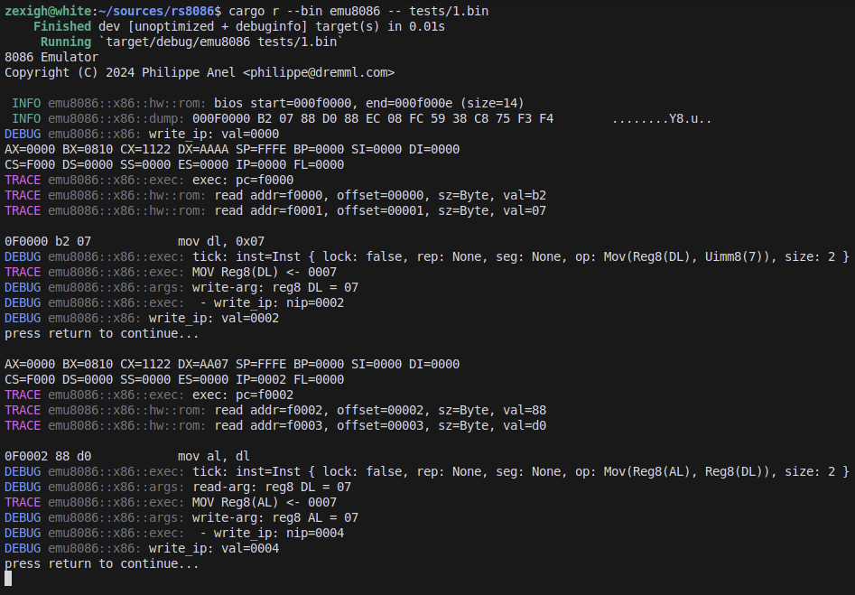
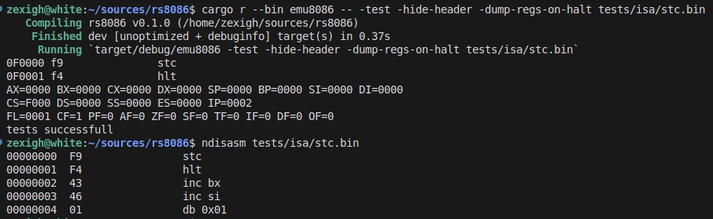

# Simple 8086 emulator in Rust programming language

!!! WIP !!! (not fully working) ... I'll keep working on it until it's fully working, and then I'll remove this disclaimer.

## For the curious

I started this project because I was curious how the 8086 worked, and I wanted to see how far I could get with
emulating it in Rust.

It does not rely on any external libraries, all the logic is implemented in Rust (except for logging of course).

It is expected to come with a lot of bugs at the beginning. If you want to contribute, please do so, but keep in mind that I'll work on it everyday it will change a lot even if it will take some time to reach a stable state.

## Current state

At the moment it is only able to execute some instructions ... 

I plan to add : 

- [ ] add a GUI (both desktop and web)
- [ ] add a debugger
- [ ] add a disassembler
- [ ] add an assembler

- [ ] add support for the 8087 FPU
- [ ] add support for the 80186/80286/80386/80486 ??? 
- [ ] add emulation of the 8086 BIOS and XT hardware, until it can run DOS programs
- [ ] make it work on Raspberry Pi Pico (2 with RP2350/RISC-V) boards

## License

This project is licensed under the MIT license. Do whatever you want with it, but keep in mind that it may contain bugs.

## How to compile a test ROM :

For the moment, you'll require [NASM](https://www.nasm.us/) to assemble the file.

```
nasm -f bin -o tests/1.bin tests/1.asm
```

## Building and running

Of course you'll need [Rust](https://www.rust-lang.org/tools/install) to build the project. I'll add release binaries as soon as it gets to a stable state.

```
cargo run --bin=emu8086 -- <rom-file.bin>
```




